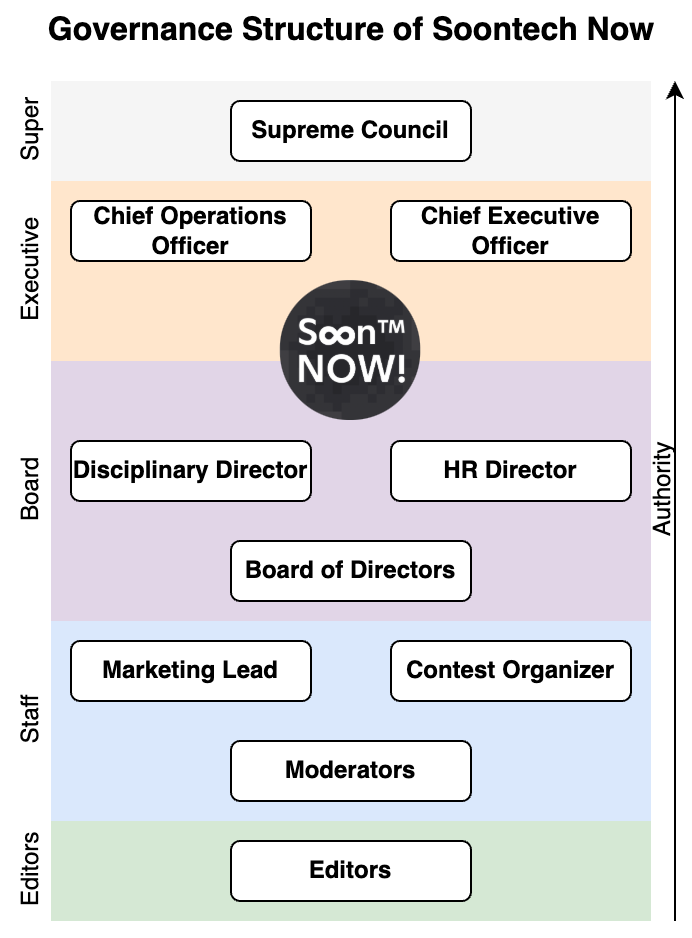

# The Constitution of Soontech Now!

## Preamble
The Constitution of Soontech Now! is a living document that outlines the core governance of the Soontech Now! community. This document shall be the supreme law of the community and will be the foundation upon which all other laws and policies are built.

## Article I: Membership
Membership in Soontech Now! is open to all individuals, defined as those who have joined the Soontech Now! Discord server, excluding bots and those who have been banned from the server. Members are entitled to all rights and privileges outlined in this Constitution.

## Article II: Purpose
The purpose of Soontech Now! is to provide a welcoming and inclusive community for all individuals interested in Minecraft encoded storage technology. Soontech Now! shall provide a platform for members to share knowledge, collaborate on projects, and engage in discussions related to Minecraft encoded storage technology. Soontech Now! shall also be responsible for organizing events, maintaining resources, and promoting the growth of the community.

## Article III: Leadership Structure
In the interest of maintaining a fair and community-driven governance structure, Soontech Now! shall be led using a system of managed democracy consisting of five branches: the Supreme Council, the Executive, the Board, the Staff, and the Editorial Branch. Each branch shall have its own responsibilities and powers, as outlined in this Constitution.

## Article IV: The Supreme Council
In order to ensure the security and continuing stability of Soontech Now!, the Supreme Council shall be the highest governing body of Soontech Now! and shall be given absolute authority over all matters. Members of the Supreme Council shall be the privileged members of the parent organization, Soontech Annals, who are appointed by an internal vote, based on their experience and dedication to the encoded community. The Supreme Council shall have administrative powers over community spaces and all other branches of Soontech Now! The Supreme Council promises to operate in a hands-off manner and will only intervene in the event of a crisis or emergency.

## Article V: The Executive Branch
The Executive Branch shall be responsible for the administrative operations of Soontech Now! and shall be led by the Chief Executive Officer (CEO) and the Chief Operating Officer (COO). Both shall be given administrative powers over community spaces.

### Section 1: Chief Executive Officer (CEO)
The CEO shall embody wisdom and be responsible for the overall direction and vision of Soontech Now! The CEO shall be appointed by general election and shall serve a term of one year.

### Section 2: Chief Operating Officer (COO)
The COO shall embody understanding and be responsible for overseeing the governance of Soontech Now! The COO shall also be appointed by general election and shall serve a term of one year.

## Article VI: The Board
The Board shall be responsible for the aquisition and management of resources for Soontech Now! This shall include the management of funds, the acquisition of people, and the allocation of resources to various projects and initiatives.

### Section 1: Board Members
The Board shall consist of up to five members and shall embody harmony. Each member shall be appointed by the Executive Branch with a unanimous vote of the CEO and COO. Once appointed, Board members shall serve until they resign or are removed by a general referendum.

### Section 2: HR Director
The HR Director shall embody kindness and be responsible for the recruitment of staff to create a positive environment for everyone. The HR Director shall be appointed by the Board from among its members with a majority vote and shall serve a term of one year. The HR Director shall have the power to appoint staff members as they see fit. Only the HR Director may appoint staff members.

### Section 3: Disciplinary Director
The Disciplinary Director shall embody justice and be responsible for enforcing the rules and regulations of Soontech Now! The Disciplinary Director shall be appointed by the Board from among its members with a majority vote and shall serve a term of one year. The Disciplinary Director shall have the power to issue warnings, temporary bans, and permanent bans to non-staff members who violate the rules. The disciplinary director shall also have the power demote staff members who do not fulfill their duties. Only the Disciplinary Director may issue permanent bans and demote staff members.

### Section 4: Board Powers
The Board shall be responsible for the management of funds and shall have the power to allocate resources to various projects and initiatives with a majority vote. The Board shall also have the power to create and dissolve positions within Soontech Now! with a majority vote, except for the positions outlined in this Constitution.

## Article VII: The Staff
The Staff shall be responsible for the day-to-day operations of Soontech Now! and shall be appointed by the HR Director and removed by the Disciplinary Director. Staff members shall be responsible for moderating community spaces, organizing events, and maintaining resources.

### Section 1: Staff Positions
The Staff shall have the following leadership positions: the Marketing Lead, the Events Lead, and Moderators. Each position shall be appointed by the HR Director and shall serve a term of one year.

### Section 2: Marketing Lead
The Marketing Lead shall embody humility, and be responsible for promoting the achievement of Soontech Now!'s members. The Marketing Lead shall have the power to create and manage social media accounts, create promotional materials, and organize marketing campaigns.

### Section 3: Events Lead
The Events Lead shall embody endurance, and be responsible for organizing events and activities for Soontech Now! The Events Lead shall have the power to create and manage event schedules, coordinate with other organizations, and recruit volunteers to help with events.

### Section 4: Moderators
The Moderators shall embody flexibility, and be responsible for the health of discussion in community spaces. Moderators shall have the power to time out members who violate the rules and delete spam messages. The moderators shall also have the power to manage the editorial branch, including the appointment and removal of editors.

## Article VIII: The Editorial Branch
The Editorial Branch shall embody consistency and be responsible for curating content for Soontech Now! archives. This shall include the tagging of posts, and reviewing and editing of posts for official publication. The Editorial Branch shall be based on a meritocratic system, with members being selected based on their contributions to the community.

### Section 1: Editorial Powers
The Editorial Branch shall have total control over the content of the Soontech Now! archives and shall have the power to approve or reject posts for official publication at the end of the year. The Editors may also set guidelines for the submission of posts and may request revisions from authors. Editors who are inactive for more than three months shall be retired at the discretion of the moderators.